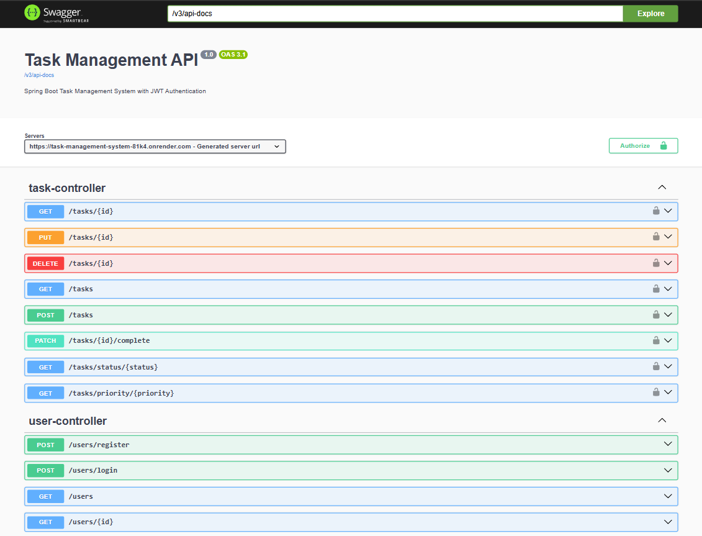
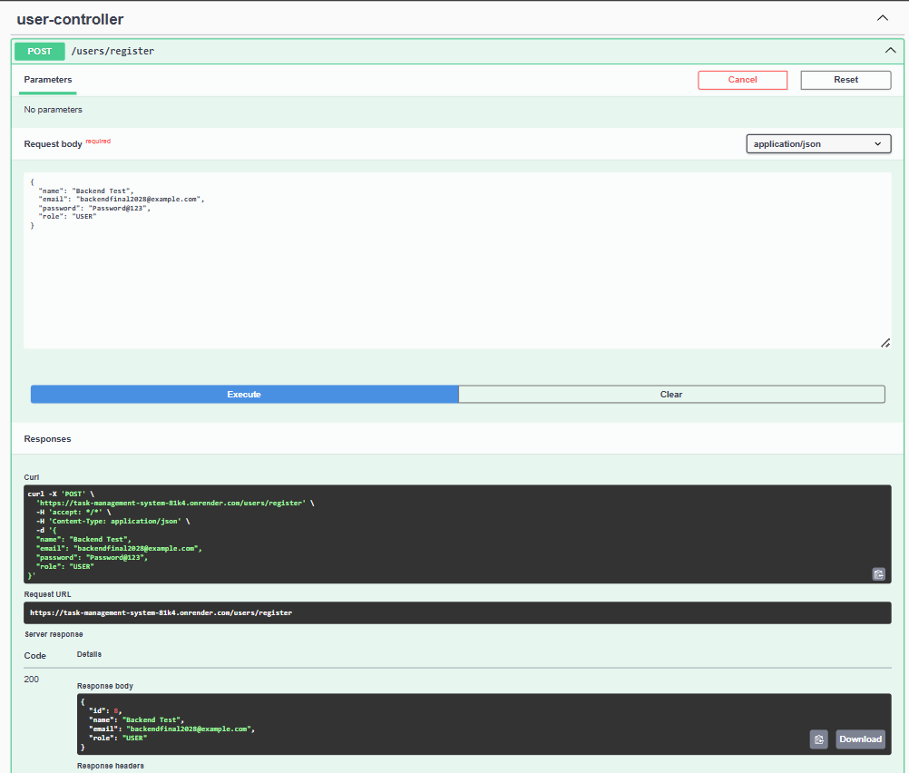
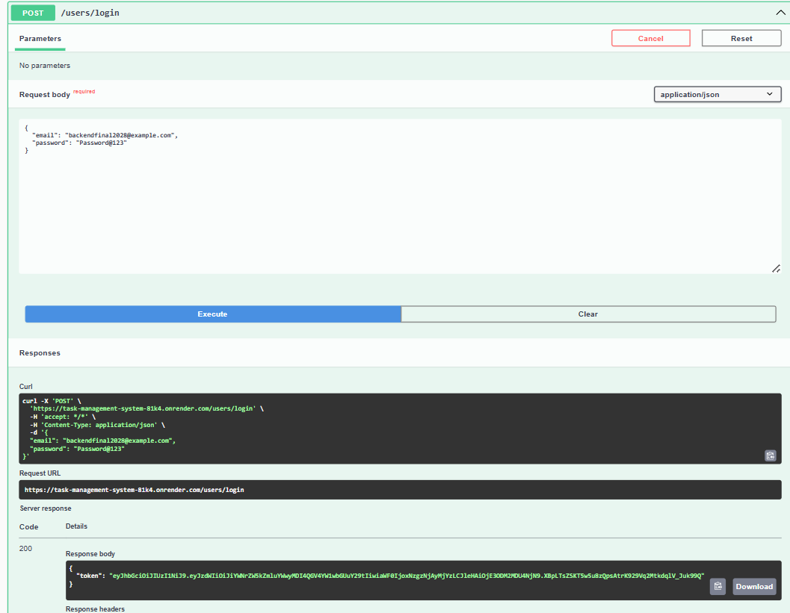
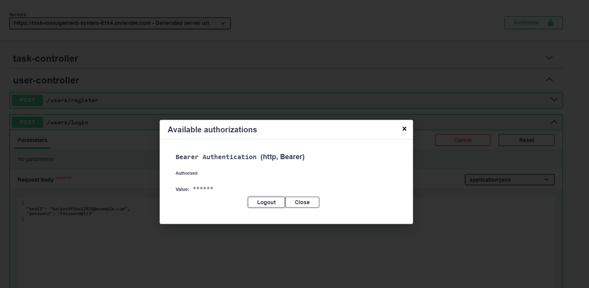
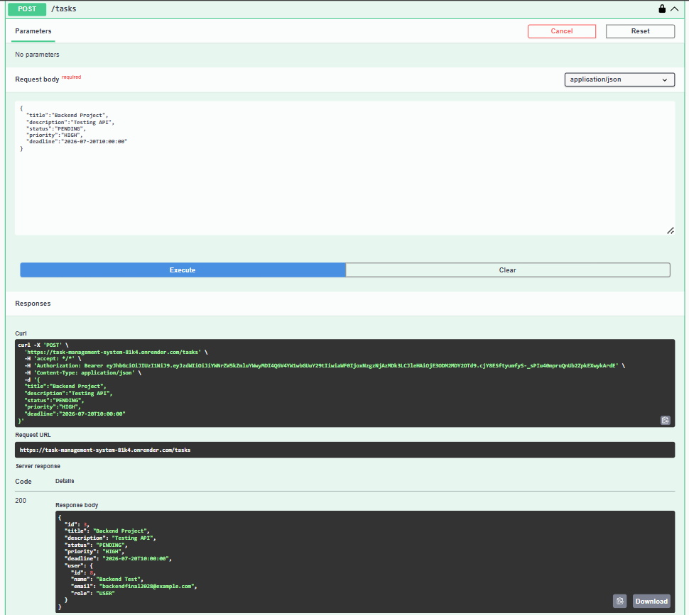
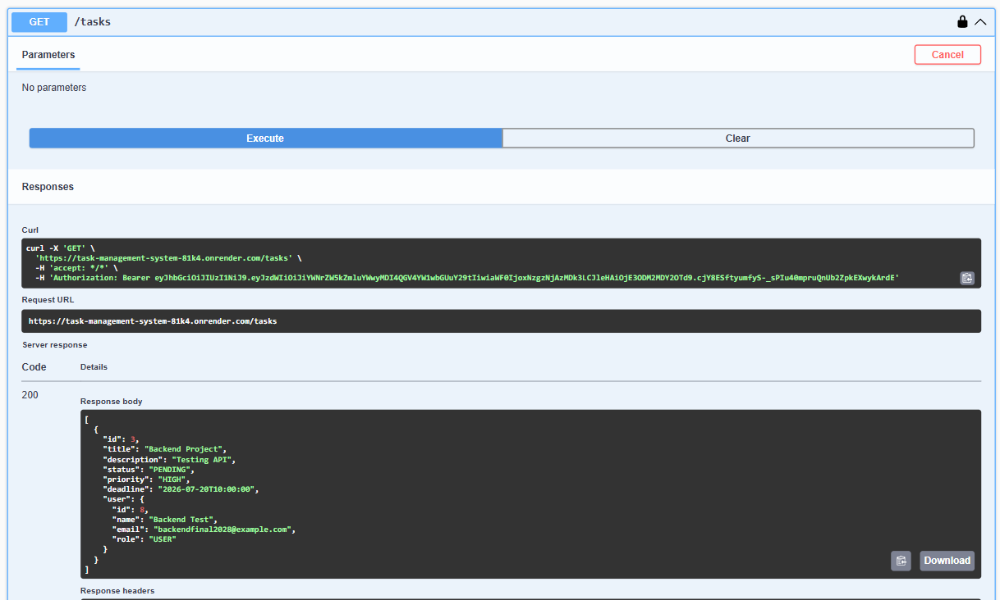
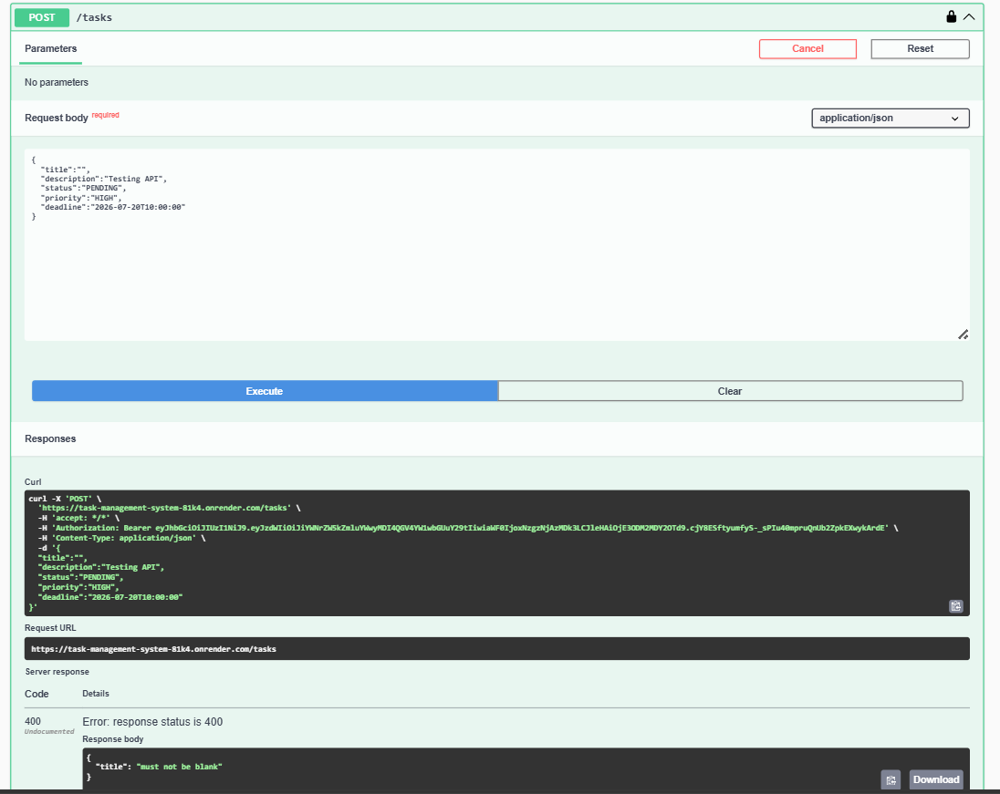
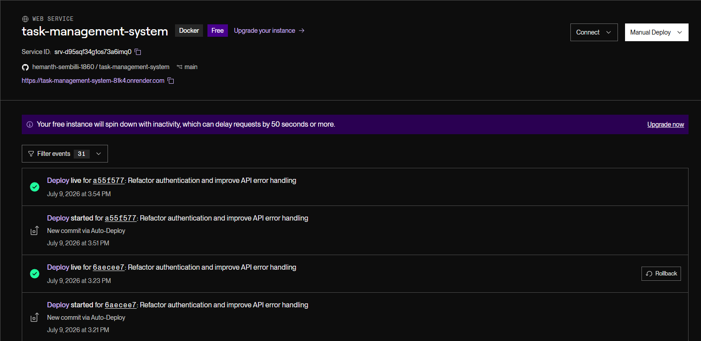

# Task Management System

A secure RESTful Task Management System built using Spring Boot, Spring Security, JWT Authentication, PostgreSQL, Hibernate, and Spring Data JPA.

The application enables authenticated users to manage their personal tasks securely. Each user can create, update, delete, and view only their own tasks using JWT-based authentication and ownership-based authorization.

---

## Live Demo

### Backend API

https://task-management-system-81k4.onrender.com

### Swagger UI

https://task-management-system-81k4.onrender.com/swagger-ui/index.html#/

---

## Features

### Authentication & Authorization

- User Registration
- User Login
- Password Encryption using BCrypt
- JWT Authentication
- Protected REST APIs using Bearer Token
- Ownership-based Task Authorization

### Task Management

- Create Task
- View All Personal Tasks
- Get Task by ID
- Update Task
- Delete Task
- Mark Task as Completed

### Task Filtering

- Filter Tasks by Status
  - PENDING
  - IN_PROGRESS
  - COMPLETED

- Filter Tasks by Priority
  - LOW
  - MEDIUM
  - HIGH

### Validation & Exception Handling

- Request Validation
- Global Exception Handling
- 400 Bad Request
- 401 Unauthorized
- 404 Not Found
- 409 Conflict

---

## Tech Stack

- Java 17
- Spring Boot
- Spring Security
- JWT (JSON Web Token)
- Spring Data JPA
- Hibernate
- PostgreSQL
- Maven
- Swagger / OpenAPI
- Render

---

## Project Structure

```text
src/main/java/com/taskmanager
├── config
├── controller
├── dto
├── entity
├── exception
├── repository
├── security
├── service
└── util
```

---

## REST API Endpoints

### User APIs

| Method | Endpoint |
|---------|----------|
| POST | `/users/register` |
| POST | `/users/login` |
| GET | `/users` |
| GET | `/users/{id}` |

### Task APIs

| Method | Endpoint |
|---------|----------|
| POST | `/tasks` |
| GET | `/tasks` |
| GET | `/tasks/{id}` |
| PUT | `/tasks/{id}` |
| DELETE | `/tasks/{id}` |
| PATCH | `/tasks/{id}/complete` |

### Filter APIs

| Method | Endpoint |
|---------|----------|
| GET | `/tasks/status/{status}` |
| GET | `/tasks/priority/{priority}` |

---

## Security Workflow

1. Register a new user.
2. Login using your email and password.
3. Receive a JWT token.
4. Open Swagger UI.
5. Click the **Authorize** button.
6. Paste the JWT token.
7. Access the protected task APIs.

---

## Screenshots

### Swagger Documentation



### User Registration



### User Login (JWT)



### JWT Authorization



### Create Task



### View Personal Tasks



### Validation Example



### Render Deployment



---

## Future Improvements

- Role-based Authorization (ADMIN / USER)
- Pagination & Sorting
- Search Tasks
- Email Notifications
- File Attachments
- Unit & Integration Testing
- Docker Support
- CI/CD with GitHub Actions
- React Frontend Integration

---

## Author

**Hemanth**
